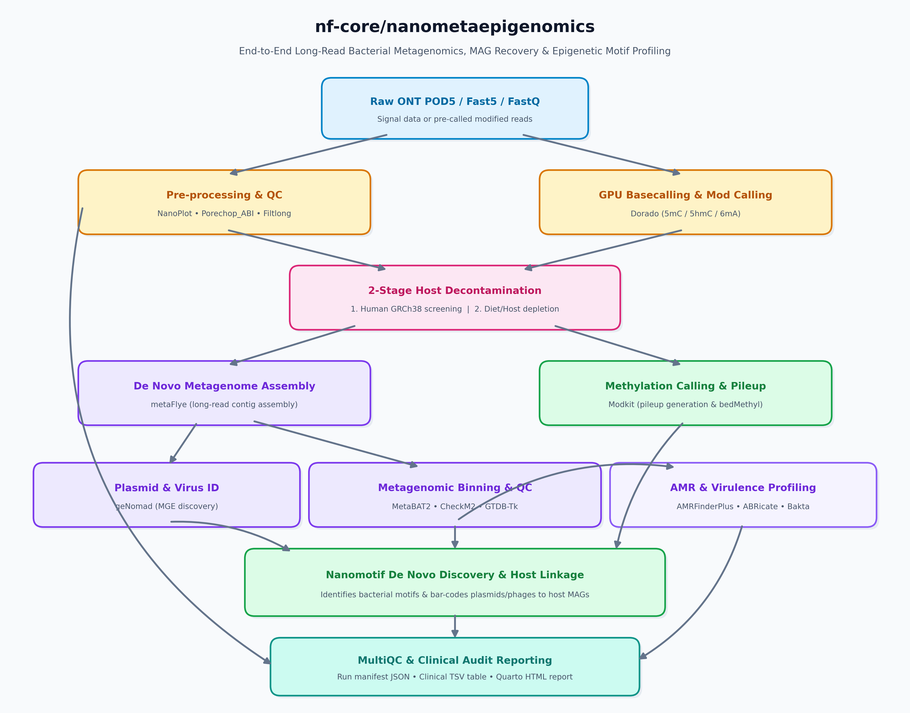

<h1>
  <picture>
    <source media="(prefers-color-scheme: dark)" srcset="docs/images/nf-core-nanometaepigenomics_logo_dark.png">
    
  </picture>
</h1>

[](https://github.com/codespaces/new/nf-core/nanometaepigenomics)
[](https://github.com/nf-core/nanometaepigenomics/actions/workflows/nf-test.yml)
[](https://github.com/nf-core/nanometaepigenomics/actions/workflows/linting.yml)[](https://nf-co.re/nanometaepigenomics/results)[](https://doi.org/10.5281/zenodo.XXXXXXX)
[](https://www.nf-test.com)

[](https://www.nextflow.io/)
[](https://github.com/nf-core/tools/releases/tag/4.1.0)
[](https://docs.conda.io/en/latest/)
[](https://www.docker.com/)
[](https://sylabs.io/docs/)
[](https://cloud.seqera.io/launch?pipeline=https://github.com/nf-core/nanometaepigenomics)

[](https://nfcore.slack.com/channels/nanometaepigenomics)[](https://bsky.app/profile/nf-co.re)[](https://mstdn.science/@nf_core)[](https://www.youtube.com/c/nf-core)

## Introduction

**nf-core/nanometaepigenomics** is a clinical-grade, end-to-end bioinformatics pipeline designed for Oxford Nanopore Technologies (ONT) long-read metagenomic sequencing. It couples high-accuracy long-read metagenomic de novo assembly and Metagenome-Assembled Genome (MAG) recovery with native bacterial epigenetic profiling (5mC/5hmC/6mA methylation calling and motif identification). Crucially, the pipeline leverages `Nanomotif` to link unbinned mobile genetic elements (plasmids and phages identified by `geNomad`) back to host bacterial MAGs via shared restriction-modification methylation motifs.



### Pipeline Steps Overview

1. **Raw Read QC & Basecalling**:
   - Sequencing read QC ([`NanoPlot`](https://github.com/wdecoster/NanoPlot)).
   - GPU-accelerated basecalling and modified basecalling with MM/ML tags ([`Dorado`](https://github.com/nanoporetech/dorado)).
   - Adapter trimming ([`Porechop_ABI`](https://github.com/bonsai-team/Porechop_ABI)) and length/quality filtering ([`Filtlong`](https://github.com/rrwick/Filtlong)).
2. **2-Stage Host Decontamination**:
   - Stage 1: Human GRCh38 privacy screening and depletion ([`Minimap2`](https://github.com/lh3/minimap2) + [`Samtools`](http://www.htslib.org/)).
   - Stage 2: Background food matrix / declared host depletion ([`Minimap2`](https://github.com/lh3/minimap2) + [`Mosdepth`](https://github.com/brentp/mosdepth)).
3. **De Novo Assembly & MGE Prediction**:
   - Long-read metagenome assembly ([`metaFlye`](https://github.com/fenderglass/Flye)).
   - Plasmid and viral element identification ([`geNomad`](https://github.com/apcamargo/genomad)).
4. **Binning & MAG Profiling**:
   - Metagenomic binning ([`MetaBAT2`](https://bitbucket.org/berkeleylab/metabat/src/master/)).
   - MAG quality and completeness assessment ([`CheckM2`](https://github.com/chklovski/CheckM2)).
   - Taxonomic classification ([`GTDB-Tk`](https://github.com/Ecogenomics/GTDBTk)).
5. **Epigenomics & Plasmid-Host Linkage**:
   - Modification pileup generation ([`Modkit`](https://github.com/nanoporetech/modkit)).
   - De novo bacterial methylation motif discovery and plasmid-to-host genome association ([`Nanomotif`](https://github.com/philshanc/nanomotif)).
6. **Surveillance & Functional Annotation**:
   - Antimicrobial resistance profiling ([`AMRFinderPlus`](https://github.com/ncbi/amr)).
   - Virulence factor screening ([`ABRICATE`](https://github.com/tseemann/abricate) with VFDB) and plasmid replicon typing ([`PlasmidFinder`](https://bitbucket.org/genomicepidemiology/plasmidfinder/src/master/)).
   - Rapid prokaryotic genome functional annotation ([`Bakta`](https://github.com/oschwengers/bakta)).
7. **Quality Control & Reporting**:
   - Audit manifest generation (`*_run_manifest.json`) and clinical summary table (`*_clinical_report.tsv`).
   - Aggregate quality reports across all tools ([`MultiQC`](http://multiqc.info/)).

## Usage

> [!NOTE]
> If you are new to Nextflow and nf-core, please refer to [this page](https://nf-co.re/docs/get_started/environment_setup/overview) on how to set-up Nextflow. Make sure to [test your setup](https://nf-co.re/docs/get_started/run-your-first-pipeline) with `-profile test` before running the workflow on actual data.

First, prepare a samplesheet with your input data that looks as follows:

`samplesheet.csv`:

```csv
sample,fastq_1
SAMPLE_1,/path/to/reads/SAMPLE_1.fastq.gz
SAMPLE_2,/path/to/reads/SAMPLE_2.fastq.gz
```

Each row represents an ONT run with long reads (gzipped FASTQ). If starting directly from Oxford Nanopore raw signal data (`.pod5`), you can point the pipeline to your POD5 folder via `--pod5_dir`.

Now, you can run the pipeline using:

```bash
nextflow run nf-core/nanometaepigenomics \
   -profile <docker/singularity/.../institute> \
   --input samplesheet.csv \
   --outdir <OUTDIR>
```

> [!WARNING]
> Please provide pipeline parameters via the CLI or Nextflow `-params-file` option. Custom config files including those provided by the `-c` Nextflow option can be used to provide any configuration _**except for parameters**_; see [docs](https://nf-co.re/docs/running/run-pipelines#using-parameter-files).

For more details and further functionality, please refer to the [usage documentation](https://nf-co.re/nanometaepigenomics/usage) and the [parameter documentation](https://nf-co.re/nanometaepigenomics/parameters).

## Pipeline output

To see the results of an example test run with a full size dataset refer to the [results](https://nf-co.re/nanometaepigenomics/results) tab on the nf-core website pipeline page.
For more details about the output files and reports, please refer to the
[output documentation](https://nf-co.re/nanometaepigenomics/output).

## Credits

nf-core/nanometaepigenomics was originally written by Jyotirmoy Das ([@JD2112](https://github.com/JD2112)).

## Contributions and Support

If you would like to contribute to this pipeline, please see the [contributing guidelines](docs/CONTRIBUTING.md).

For further information or help, don't hesitate to get in touch on the [Slack `#nanometaepigenomics` channel](https://nfcore.slack.com/channels/nanometaepigenomics) (you can join with [this invite](https://nf-co.re/join/slack)).

## Citations

An extensive list of references for the tools used by the pipeline can be found in the [`CITATIONS.md`](CITATIONS.md) file.

You can cite the `nf-core` publication as follows:

> **The nf-core framework for community-curated bioinformatics pipelines.**
>
> Philip Ewels, Alexander Peltzer, Sven Fillinger, Harshil Patel, Johannes Alneberg, Andreas Wilm, Maxime Ulysse Garcia, Paolo Di Tommaso & Sven Nahnsen.
>
> _Nat Biotechnol._ 2020 Feb 13. doi: [10.1038/s41587-020-0439-x](https://dx.doi.org/10.1038/s41587-020-0439-x).
